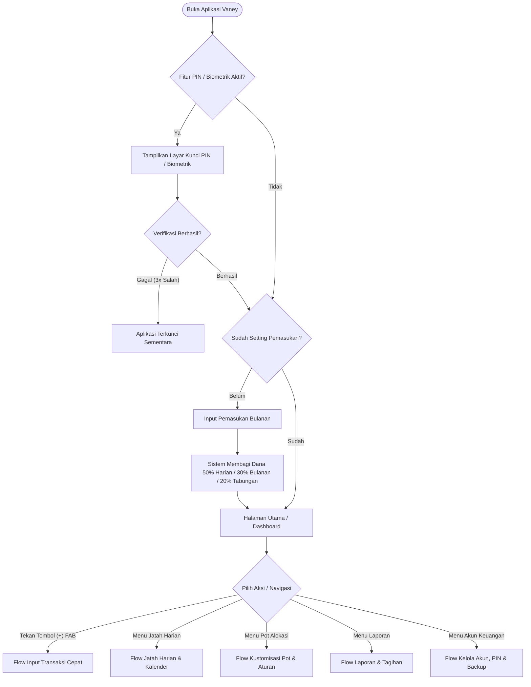
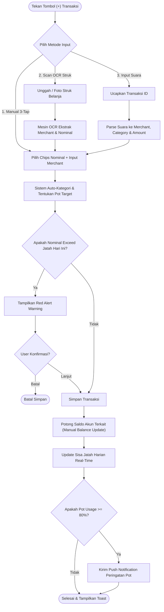
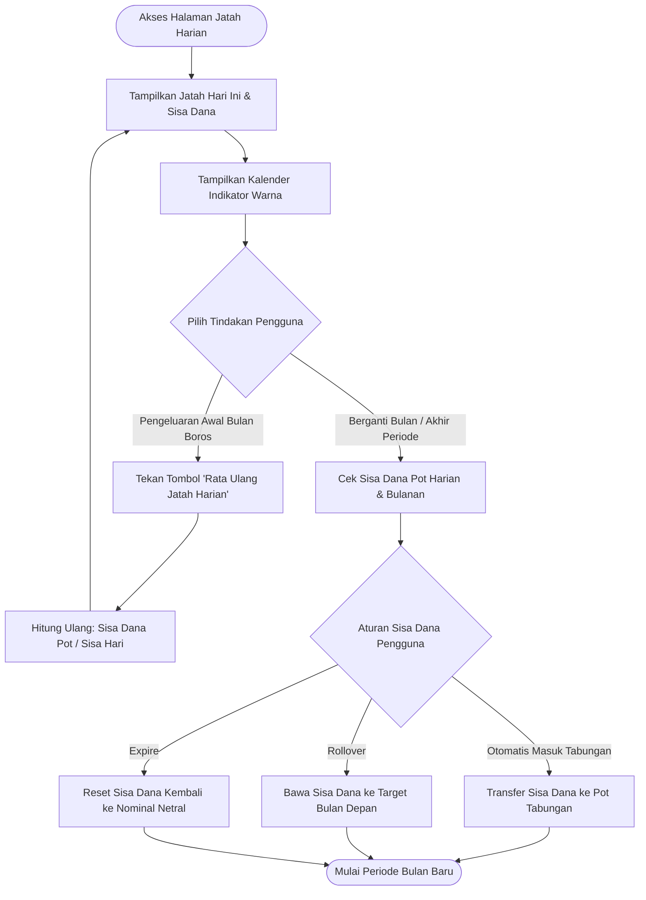
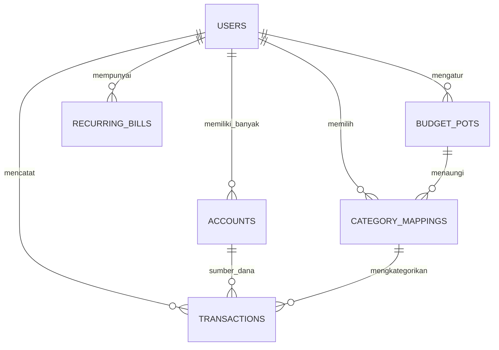
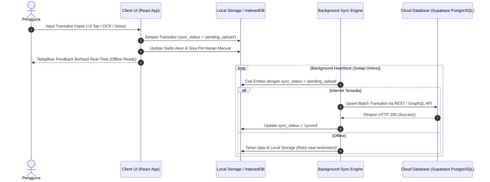
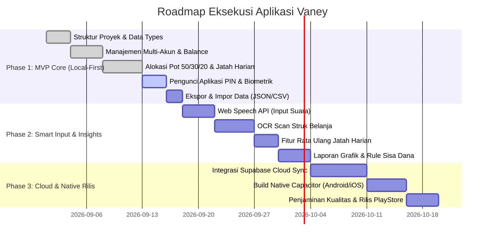

# Product Requirements Document (PRD) - Aplikasi Mobile Pencatat Keuangan Pribadi (Vaney)

## 1. Overview
Aplikasi pencatat keuangan pribadi **Vaney** dirancang untuk membantu pengguna mengelola pemasukan dan pengeluaran harian secara disiplin melalui sistem alokasi otomatis yang memudahkan kontrol keuangan tanpa perlu tracking manual yang merepotkan. Target utama aplikasi adalah individu atau pekerja yang ingin meningkatkan kedisiplinan pengelolaan keuangan dengan fitur yang intuitif, otomatis, dan berestetika tinggi.

---

## 2. Problem Statement
Banyak individu kesulitan dalam mengatur keuangan pribadi karena metode pencatatan manual yang rumit dan memakan waktu. Hal ini sering menyebabkan pengeluaran tidak terkontrol dan kurangnya pemahaman tentang alokasi anggaran yang tepat, sehingga sulit menabung dan berinvestasi secara konsisten.

---

## 3. Goals & Success Metrics

### Goals
- **Mempermudah pengguna** dalam mencatat transaksi keuangan dengan cepat dan akurat.
- **Otomatisasi alokasi anggaran** untuk meningkatkan disiplin pengelolaan keuangan (prinsip 50/30/20).
- **Memberikan insight dan laporan** yang membantu pengguna memahami kebiasaan pengeluaran mereka.
- **Menjamin privasi data keuangan** pengguna dengan sistem keamanan PIN & Biometrik lokal.

### Success Metrics
- Minimal **80% transaksi** dapat dicatat dalam maksimal **3 tap**.
- Setidaknya **70% pengguna** mengaktifkan fitur alokasi otomatis dan kustomisasi pot.
- Pengguna aktif harian mencapai **60%** dari total pengguna terdaftar.
- Feedback positif minimal **85%** terkait kemudahan penggunaan, fitur alokasi, dan keamanan privasi.

---

## 4. User Personas
1. **Rizki (28 tahun, Karyawan Swasta)**: Ingin mengatur keuangan agar dapat menabung dan berinvestasi meski pendapatan pas-pasan.
2. **Sari (35 tahun, Ibu Rumah Tangga)**: Mengelola keuangan keluarga dan ingin kontrol pengeluaran harian lebih baik tanpa repot catat manual.
3. **Andi (24 tahun, Freelancer)**: Memiliki banyak sumber pemasukan dan pengeluaran dari berbagai akun (Bank, E-Wallet), butuh aplikasi multi-akun dengan alokasi otomatis.

---

## 5. User Stories per Fitur
- **Input Transaksi**: Sebagai pengguna, saya ingin mencatat transaksi dengan cepat dan otomatis mengkategorikan berdasarkan merchant agar tidak perlu repot pilih kategori manual.
- **Multi-Akun**: Sebagai pengguna, saya ingin mengelola berbagai sumber dana seperti rekening bank, e-wallet, dan kartu kredit agar saldo tiap akun terlihat jelas secara manual tanpa perlu menghubungkan akun ke server bank.
- **Alokasi Anggaran Otomatis**: Sebagai pengguna, saya ingin pemasukan saya dibagi otomatis ke pot kebutuhan harian, bulanan, dan tabungan agar saya bisa mengikuti prinsip 50/30/20 tanpa repot menghitung.
- **Jatah Harian**: Sebagai pengguna, saya ingin tahu jatah pengeluaran harian saya secara real-time agar saya tidak melewati batas harian dan bisa mengatur pengeluaran dengan bijak.
- **Laporan & Insight**: Sebagai pengguna, saya ingin laporan bulanan yang mudah dipahami dan insight tren pengeluaran agar bisa mengambil keputusan keuangan lebih baik.
- **Keamanan PIN & Biometrik**: Sebagai pengguna, saya ingin mengunci aplikasi Vaney dengan PIN atau Biometrik (Fingerprint/Face ID) agar data keuangan saya aman saat HP dipinjam atau hilang.
- **Keamanan & Reliabilitas**: Sebagai pengguna, saya ingin aplikasi tetap bisa digunakan offline dan data saya aman dengan backup otomatis.

---

## 6. Functional Requirements

### A. Input Transaksi
- Fitur input cepat maksimal **3 tap**.
- Kategori otomatis berdasarkan data merchant (e.g. Indomaret $\rightarrow$ Belanja, Starbucks $\rightarrow$ Makanan), dengan opsi edit manual.
- Fitur **scan struk** menggunakan OCR dan **input suara** (Web Speech API / Speech Recognition) untuk pencatatan transaksi.

### B. Multi-Akun (Input & Update Saldo Manual)
- Dukungan untuk berbagai jenis akun: Rekening Bank (BCA, Mandiri, BRI, dll.), E-Wallet (GoPay, OVO, ShopeePay, DANA), Kas Tunai, dan Kartu Kredit.
- Tampilan saldo terpisah per akun serta total kekayaan (Net Worth).
- Fitur transfer dana antar akun.
- **Eksplisit**: Aplikasi **TIDAK** terhubung secara otomatis via API/Open Banking ke server bank. Seluruh saldo dan perubahan transaksi akun diinput dan diperbarui secara manual oleh pengguna (atau via scan struk OCR & input suara), bukan ditarik otomatis dari sistem perbankan.

### C. Alokasi Anggaran Otomatis (Pots System)
- Sistem otomatis membagi pemasukan bulanan ke 3 pot default:
  - **50% Kebutuhan Harian**
  - **30% Kebutuhan Bulanan**
  - **20% Tabungan & Investasi**
- Kustomisasi persentase alokasi pot oleh pengguna.
- Mapping kategori transaksi ke pot tertentu.
- Visualisasi progress bar sisa dan penggunaan dana per pot (Indikator warna Hijau/Kuning/Merah).
- Notifikasi push/in-app saat pot mencapai 80-90% penggunaan.
- Pengaturan sisa dana di akhir periode: dibawa ke bulan depan (rollover), hangus, atau otomatis masuk tabungan.

### D. Jatah Harian (Daily Allowance)
- Perhitungan jatah harian dari pot kebutuhan harian dibagi rata per jumlah hari tersisa dalam periode/bulan.
- Tampilan real-time jatah hari ini, terpakai, dan sisa.
- Notifikasi pagi berisi informasi jatah harian.
- Alert transaksi yang menyebabkan pengeluaran melewati jatah harian.
- Kalender bulanan dengan indikator warna per hari: **Hijau** (Hemat), **Kuning** (Pas), **Merah** (Boros).
- Opsi **Rata Ulang Jatah Harian** jika pengeluaran di awal periode boros.
- Riwayat transaksi harian ditampilkan secara ringkas di halaman jatah harian.

### E. Laporan & Insight
- Ringkasan bulanan grafik pemasukan vs pengeluaran per kategori.
- Laporan perbandingan alokasi rencana vs realisasi.
- Insight tren kenaikan pengeluaran kategori tertentu.
- Reminder tagihan berulang (Sewa, Listrik, WiFi, Asuransi).

### F. Keamanan & Reliabilitas
- **Fitur Pengunci Aplikasi**: Pengamanan aplikasi dengan **PIN 4/6-Digit** dan/atau **Biometrik (Fingerprint / Face ID)** saat aplikasi dibuka untuk mencegah akses orang lain yang meminjam HP atau saat HP hilang.
- Mode offline-first dengan penyimpanan lokal yang terenkripsi.
- Backup data otomatis secara berkala (Ekspor/Impor file JSON & CSV).

---

## 7. Non-Functional Requirements
- Responsif dan cepat pada perangkat mobile dengan berbagai ukuran layar.
- Keamanan data pengguna dengan enkripsi AES-256 pada penyimpanan lokal dan transmisi data.
- Perlindungan privasi penuh tanpa pengumpulan credential bank pengguna.
- Stabilitas aplikasi dengan minim gangguan dan crash.
- Desain UI/UX yang intuitif, modern, dan mudah digunakan oleh berbagai kalangan usia.
- Dukungan multi-platform (Android & iOS) dengan performa konsisten.

---

## 8. Prioritas Fitur (MoSCoW)
- **Must**: 
  - Input transaksi cepat (<3 tap)
  - Alokasi anggaran otomatis (50/30/20)
  - Multi-akun (dengan input & update saldo manual)
  - Jatah harian & kalender disiplin
  - Laporan bulanan
  - **Keamanan pengunci aplikasi dengan PIN & Biometrik (Fingerprint / Face ID)**
  - Keamanan offline-first & backup data (JSON/CSV)
- **Should**: 
  - Scan struk OCR
  - Input suara Bahasa Indonesia
  - Notifikasi alokasi & jatah harian
  - Kustomisasi persentase pot
  - Reminder tagihan berulang
- **Could**: 
  - Rata ulang otomatis jatah harian
  - Insight tren pengeluaran mendalam
  - Kalender indikator warna interaktif
  - Opsi penanganan sisa dana otomatis
- **Won't (TIDAK ADA DI TAHAP INI)**: 
  - **Integrasi API perbankan langsung / Open Banking / Auto-sync saldo bank real-time**. Seluruh pencatatan saldo dan transaksi bank dilakukan secara manual oleh pengguna, atau melalui scan struk OCR dan input suara.

---

## 9. Flowchart & Diagram Alur Pengguna (User Flowchart)

### A. Flowchart Alur Pengguna Utama (Main User Journey dengan Pengunci PIN & Biometrik)

---

### B. Flowchart Input Transaksi Cepat (Maksimal 3-Tap / OCR / Suara)

---

### C. Flowchart Jatah Harian & Evaluasi Akhir Periode

---

## 10. Alur Database & Skema Data (Database Architecture & Flow)

### A. Diagram Hubungan Entitas (Entity-Relationship Diagram / ERD)

---

### B. Spesifikasi Tabel / Schema Database

#### 1. Tabel `users`
| Nama Kolom | Tipe Data | Keterangan |
| :--- | :--- | :--- |
| `id` | `VARCHAR(36)` / `UUID` | Primary Key unik pengguna |
| `name` | `VARCHAR(100)` | Nama lengkap pengguna |
| `email` | `VARCHAR(150)` | Email pengguna (opsional offline) |
| `pin_hash` | `VARCHAR(255)` | Hash PIN keamanan aplikasi (opsional) |
| `is_biometric_enabled` | `BOOLEAN` | Status pengaktifan Fingerprint / Face ID |
| `monthly_income` | `DECIMAL(15,2)` | Base pemasukan bulanan default |
| `end_period_choice` | `ENUM('savings', 'carry', 'expire')` | Opsi perlakuan sisa dana akhir periode |
| `created_at` | `TIMESTAMP` | Waktu pembuatan akun |

#### 2. Tabel `accounts`
| Nama Kolom | Tipe Data | Keterangan |
| :--- | :--- | :--- |
| `id` | `VARCHAR(36)` / `UUID` | Primary Key unik akun |
| `user_id` | `VARCHAR(36)` | Foreign Key ke `users.id` |
| `name` | `VARCHAR(100)` | Nama akun (e.g. BCA Utama, GoPay) |
| `type` | `ENUM('bank', 'ewallet', 'cash', 'credit_card')` | Jenis akun keuangan |
| `balance` | `DECIMAL(15,2)` | Saldo diinput & diperbarui manual oleh pengguna |
| `account_number` | `VARCHAR(50)` | Nomor rekening / kartu (manual) |
| `is_credit` | `BOOLEAN` | True jika akun tipe kartu kredit |

#### 3. Tabel `budget_pots`
| Nama Kolom | Tipe Data | Keterangan |
| :--- | :--- | :--- |
| `id` | `VARCHAR(36)` / `UUID` | Primary Key pot (e.g. `pot-harian`) |
| `user_id` | `VARCHAR(36)` | Foreign Key ke `users.id` |
| `pot_type` | `ENUM('harian', 'bulanan', 'tabungan')` | Jenis pot 50/30/20 |
| `percentage` | `DECIMAL(5,2)` | Persentase alokasi (e.g. 50.00%) |
| `allocated_amount` | `DECIMAL(15,2)` | Nominal target alokasi bulanan |
| `remaining_amount` | `DECIMAL(15,2)` | Sisa dana real-time dalam pot |

#### 4. Tabel `category_mappings`
| Nama Kolom | Tipe Data | Keterangan |
| :--- | :--- | :--- |
| `id` | `VARCHAR(36)` / `UUID` | Primary Key kategori |
| `user_id` | `VARCHAR(36)` | Foreign Key ke `users.id` |
| `name` | `VARCHAR(100)` | Nama kategori (e.g. Makanan & Minuman) |
| `pot_type` | `ENUM('harian', 'bulanan', 'tabungan')` | Mapping pot tujuan transaksi |
| `icon_name` | `VARCHAR(50)` | Nama ikon Lucide |

#### 5. Tabel `transactions`
| Nama Kolom | Tipe Data | Keterangan |
| :--- | :--- | :--- |
| `id` | `VARCHAR(36)` / `UUID` | Primary Key transaksi |
| `user_id` | `VARCHAR(36)` | Foreign Key ke `users.id` |
| `account_id` | `VARCHAR(36)` | Foreign Key ke `accounts.id` |
| `category_id` | `VARCHAR(36)` | Foreign Key ke `category_mappings.id` |
| `type` | `ENUM('income', 'expense', 'transfer')` | Jenis transaksi |
| `amount` | `DECIMAL(15,2)` | Nominal transaksi |
| `merchant_name` | `VARCHAR(100)` | Nama merchant / toko |
| `date` | `DATE` | Tanggal transaksi (YYYY-MM-DD) |
| `time_str` | `VARCHAR(20)` | Format waktu jam (e.g. "14:30") |
| `sync_status` | `ENUM('synced', 'pending_upload', 'pending_delete')` | Status sinkronisasi cloud |

---

### C. Alur Sinkronisasi Data (Data Flow & Offline-to-Cloud Sync)

---

## 11. Next Steps: Arsitektur Teknikal & Tech Stack Yang Dibutuhkan

Berikut adalah rekomendasi arsitektur teknologi (*Tech Stack*) dan infrastruktur yang dibutuhkan untuk pengembangan tahap selanjutnya (*Next Phase Rollout*):

### A. Frontend & Mobile Client Stack
| Komponen | Teknologi | Alasan / Fungsi |
| :--- | :--- | :--- |
| **Framework Utama** | **React 19 + TypeScript + Vite** | Ringan, cepat, fleksibel, serta mendukung pengembangan komponen modern. |
| **Styling & UI** | **Tailwind CSS v4 + Motion** | Pembuatan antarmuka glassmorphic, responsif seluler, dan animasi mikro yang sangat halus. |
| **Keamanan Lokal** | **Web Biometrics API / Capacitor Biometrics Plugin** | Integrasi Fingerprint / Face ID & hashing PIN lokal. |
| **Icon Set** | **Lucide React** | Ikon modern, konsisten, dan ringan. |
| **Mobile Cross-Platform Packaging** | **Capacitor JS / PWA** | Mengubah web app React menjadi APK native Android & iOS IPA secara langsung tanpa perlu menulis ulang codebase. |

### B. Backend & Cloud Infrastructure (Pengembangan Tahap Lanjut)
| Komponen | Teknologi / Platform | Alasan / Fungsi |
| :--- | :--- | :--- |
| **Database Cloud & Auth** | **Supabase / Firebase** | Database PostgreSQL / Firestore real-time dengan dukungan Auth (Google Sign-In, Apple Sign-In), Row Level Security, dan sinkronisasi multi-perangkat. |
| **Mesin OCR (Scan Struk)** | **Google Cloud Vision API / Tesseract.js** | Mengekstrak teks struk belanja (Merchant, Tanggal, Nominal Total) secara presisi dengan akurasi tinggi. |
| **AI Financial Advisor / Insight Engine** | **Google Gemini API (`@google/genai`)** | Memberikan analisis kebiasaan pengeluaran bulanan dan rekomendasi hemat secara otomatis. |
| **Push Notification Service** | **Firebase Cloud Messaging (FCM)** | Mengirim notifikasi pagi jatah harian dan alert penggunaan pot 80-90% ke perangkat seluler pengguna. |

### C. DevOps, Security & Deployment Pipeline
- **Enkripsi Lokal**: Enkripsi AES-256 pada `LocalStorage` / `IndexedDB` untuk perlindungan data keuangan offline pengguna.
- **Tanpa Kredensial Bank**: Bebas risiko kebocoran data perbankan karena tidak menggunakan Open Banking API pihak ketiga.
- **CI/CD**: GitHub Actions untuk pengujian otomatis, build bundler, dan rilis otomatis ke Google Play Store & Apple App Store via Fastlane.

---

## 12. Roadmap Eksekusi & Timeline Rilis

### Rincian Fase Pengembangan:
1. **Fase 1: Local-First Core & Security (MVP)**
   - Implementasi data model & state persistence (Local Storage / IndexedDB).
   - Layar kunci PIN 4/6-Digit & opsi toggle biometrik.
   - Manajemen multi-akun (Bank, E-Wallet, Cash, Credit Card) dengan update saldo manual.
   - Perhitungan otomatis pot 50/30/20 & tampilan jatah harian real-time.
   - Backup & Restore data lokal (Ekspor/Impor JSON & CSV).

2. **Fase 2: Smart Input & Advanced Financial Control**
   - Integrasi input suara Bahasa Indonesia (Web Speech API).
   - Ekstraksi nominal & merchant via scan OCR struk.
   - Fitur "Rata Ulang Jatah Harian" untuk menghitung ulang sisa hari jika boros di awal bulan.
   - Aturan akhir periode sisa dana (Transfer ke Tabungan / Rollover / Expire).

3. **Fase 3: Cloud Synchronization & Native Packaging**
   - Cloud database sync via Supabase dengan mekanisme pengoperasian offline-first.
   - Packaging Capacitor JS untuk distribusi aplikasi native Android (.apk) & iOS (.ipa).
   - Firebase Push Notifications untuk peringatan pot 80% & reminder harian.

---

## 13. Matriks Risiko & Rencana Mitigasi

| Risiko | Tingkat Keparahan | Dampak | Rencana Mitigasi |
| :--- | :--- | :--- | :--- |
| **Lupa PIN Keamanan** | Tinggi | Pengguna tidak dapat mengakses aplikasi | Sediakan opsi reset data lokal dengan konfirmasi ganda atau kata sandi pemulihan. |
| **Akurasi OCR Struk Rendah** | Sedang | Nominal / merchant salah terekstraksi | Tampilkan pratinjau hasil ekstraksi OCR agar pengguna dapat melakukan edit manual sebelum disimpan. |
| **Penyimpanan Lokal Terhapus Browser** | Tinggi | Data transaksi & saldo hilang | Sediakan notifikasi berkala untuk melakukan Ekspor Backup (JSON) serta integrasi Cloud Sync otomatis di Phase 3. |
| **Browser Tidak Mendukung Web Speech API** | Rendah | Input suara gagal berfungsi | Fallback halus (graceful fallback) ke input manual 3-tap tanpa merusak UX pengguna. |
| **Ketidakseimbangan Jatah Harian (Boros di Awal Periode)** | Sedang | Jatah harian menjadi Rp 0 sebelum akhir bulan | Sediakan fitur "Rata Ulang Jatah Harian" & warning alert visual (Red Alert) saat transaksi melebihi jatah harian. |

---

## 14. Kriteria Penerimaan (Acceptance Criteria) Detail Per Fitur

### A. Fitur Keamanan PIN & Biometrik
- [ ] Layar kunci PIN muncul secara otomatis saat aplikasi dibuka jika PIN diaktifkan di Pengaturan.
- [ ] Pengguna diberikan kesempatan 3x percobaan input PIN sebelum kunci sementara aktif.
- [ ] Pengguna dapat mengaktifkan/deaktifkan biometrik (Fingerprint/Face ID) melalui menu Pengaturan.

### B. Fitur Input Transaksi Cepat (<3 Tap / Voice / OCR)
- [ ] Pengguna dapat mencatat pengeluaran kurang dari 3 tap menggunakan pilihan chip nominal cepat.
- [ ] Input suara berhasil menguraikan nominal, merchant, dan kategori secara tepat dalam Bahasa Indonesia.
- [ ] Upload foto struk mengekstraksi merchant dan total belanja dengan validasi pratinjau sebelum simpan.

### C. Fitur Jatah Harian & Rebalancing
- [ ] Perhitungan `Jatah Hari Ini` diperbarui secara instant setelah transaksi dicatat.
- [ ] Tombol `Rata Ulang Jatah Harian` membagi sisa dana pot harian secara merata ke sisa hari dalam bulan berjalan.
- [ ] Kalender indikator warna menampilkan status harian: Hijau ($\le$ jatah), Kuning (pas), Merah (> jatah).

### D. Fitur Backup & Restore Data
- [ ] Ekspor data menghasilkan file `.json` & `.csv` yang berisi seluruh tabel akun, pot, dan transaksi.
- [ ] Impor file `.json` mengembalikan seluruh state aplikasi secara akurat tanpa *corrupted data*.
